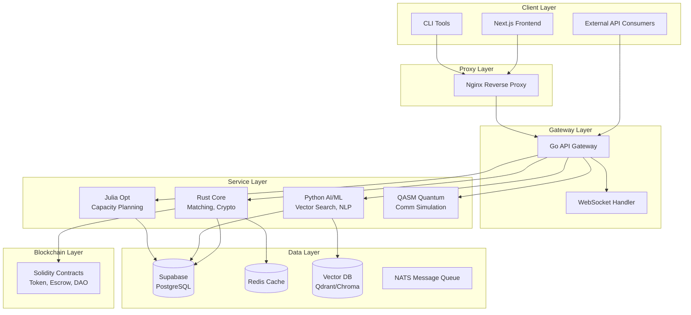

# Lunar Internet Service Broker — Architecture

## Overview

A multi-language, multi-service platform for matching lunar communication relay capacity with rover/payload operators. Commitments are recorded on-chain via Solidity smart contracts.

## System Architecture



## Data Flow

### Marketplace Matching Flow

```
1. Operator creates relay request (via API/Frontend)
2. Provider creates capacity offer (via API/Frontend)
3. Go Gateway validates and stores in Supabase
4. Rust Matching Engine runs scoring algorithm
5. AI/ML service enhances with semantic similarity
6. Julia Optimization Engine validates capacity feasibility
7. Match results stored and notifications sent
8. Parties commit on-chain via Solidity contract
9. Escrow holds tokens during service period
10. On fulfillment, escrow released to provider
```

## Technology Decisions

| Domain | Choice | Rationale |
|--------|--------|-----------|
| API Gateway | Go | Performance, concurrency, ecosystem |
| Core Engine | Rust | Safety, performance, WASM support |
| AI/ML | Python | ML ecosystem, FastAPI, vector DBs |
| Optimization | Julia | JuMP, scientific computing |
| Contracts | Solidity | EVM compatibility, Foundry tools |
| Quantum | QASM | Quantum communication simulation |
| Frontend | Next.js | SSR, React ecosystem, TypeScript |
| Database | Supabase | PostgreSQL, real-time, auth, storage |
| Orchestration | K8s + Swarm + Helm | Multi-target deployment |
| IaC | Pulumi | Multi-cloud, real programming languages |
